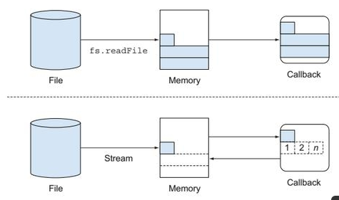

nodejs中，流是基于事件的api。    
##### 流的四种类型    
* dable 可读操作
* Writeable 可写操作
* Duplex  可读可写操作
* Transform 操作被写入数据，然后读出结果

##### 流的事件
* data    当有数据可读时触发
* end     当没有数据可读时触发
* error   在接收和写入过程中发生错误时触发
* finish  所有数据被写入到底层系统时触发

