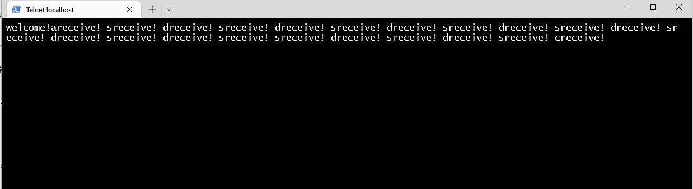
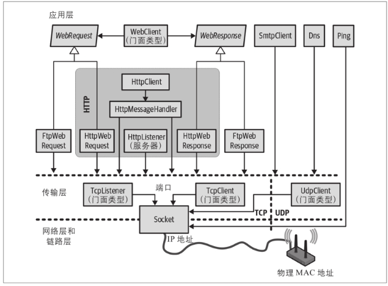

### net.createServer()创建net.Server类
#### net.Server和net.Socket都是EventEmitter的实例，都支持事件
#### net.Server类的事件
* listening         server.listen()时触发
* connection     每一个客户端连接到套接字时触发
* close    服务器关闭时触发
* error    服务器异常时触发
#### net.Socket类的事件
* data    一端调用write()事件传数据，另一端触发
* end    连接中任意一端发送了FIN数据时触发
* connect    客户端事件，套接字与服务器端连接成功触发
* drain    任意一端调用write()事件传数据，当前端触发。

#### 使用telnet测试nodejs编写的tcp服务器

##### c#网络架构图，使用TcpListener类创建tcp服务器
